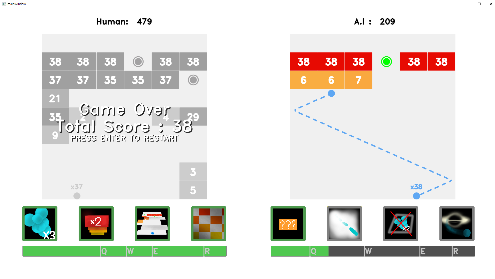
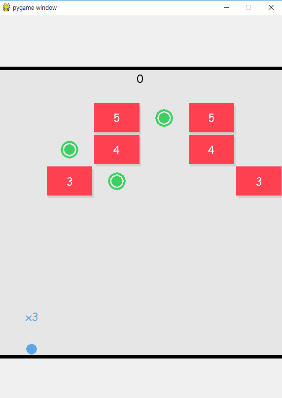
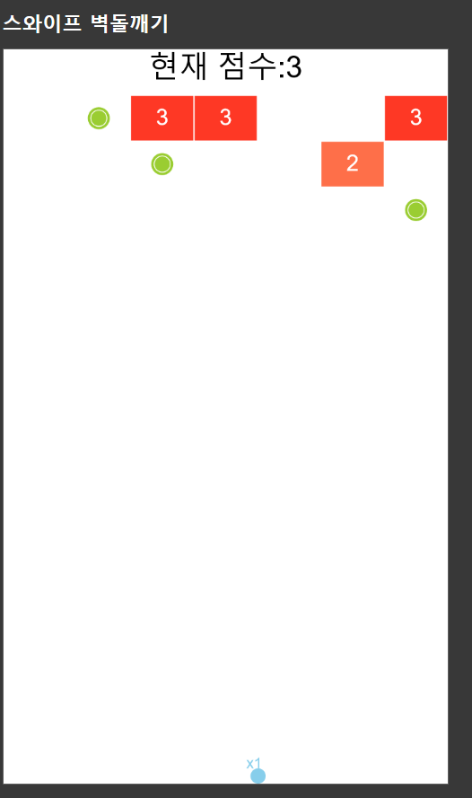

# A.P. Project
AI Player(AP)를 만드는 프로젝트 입니다.  
스와이프 벽돌깨기를 대상으로한 인공지능을 개발했습니다.

# Cpp

발표 때 인공지능에 여러 사람들이 흥미를 가질 수 있도록 게임을 만들었습니다.

# Python

# Web

### 개발진척
- [x] 벽돌깨기 플레이 기능 제작
- [x] 벽돌깨기 챌린지 모드 제작
- [ ] 파이썬과 Web에 벽돌깨기 인공지능 적용